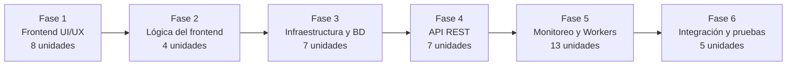

# StatusHub: Seguimiento y Plan de Tareas de Desarrollo

**Referencia de estados:** `[INICIAR]` indica una tarea pendiente de comienzo.

### Fase 1: Prototipado y Maquetado del Frontend (UI/UX)
1. **Inicialización del Proyecto Frontend:** Configurar el proyecto como Single Page Application (SPA) utilizando TypeScript y React. **Estado:** `[COMPLETADA]`
2. **Prototipado de Autenticación:** Crear las vistas de Registro e Inicio de sesión para los clientes (RF-01). **Estado:** `[COMPLETADA]`
3. **Prototipado del Panel Privado (Dashboard):** Maquetar la vista principal destacando visualmente los servicios caídos (RNF-06). Incluir el listado de servicios y la maqueta del gráfico de disponibilidad de los últimos 30 días (RF-05). **Estado:** `[COMPLETADA]`
4. **Formularios de Gestión de Servicios:** Crear los componentes modales o páginas para dar de alta, editar y eliminar servicios propios (RF-02). **Estado:** `[COMPLETADA]`
5. **Prototipado del Historial de Incidentes:** Maquetar la tabla de incidentes y el botón para exportación CSV (RF-06, RF-08). **Estado:** `[COMPLETADA]`
6. **Prototipado de la Página Pública:** Diseñar la vista de estado de solo lectura para los visitantes sin autenticación (RF-07) e incorporar la búsqueda por nombre o URL de servicios públicos (RF-09). **Estado:** `[COMPLETADA]`
7. **Dockerización inicial del Frontend:** Crear el `Dockerfile` para correr el frontend en contenedores durante el desarrollo. **Estado:** `[COMPLETADA]`

### Fase 2: Lógica del Frontend (Mocks y Estado)
1. **Configuración de Enrutamiento:** Implementar el router de la SPA para proteger las rutas privadas (requieren token) y exponer las públicas. **Estado:** `[INICIAR]`
2. **Integración de API simulada (Mocks):** Crear datos falsos (JSON) y servicios HTTP (ej. con Axios o Fetch) para simular el comportamiento del backend. **Estado:** `[INICIAR]`
3. **Lógica de Exportación CSV:** Desarrollar la función en TypeScript para generar y descargar el archivo CSV con las columnas obligatorias (RF-08). **Estado:** `[INICIAR]`
4. **Cálculo de Métricas en UI:** Implementar la lógica para renderizar la fórmula de disponibilidad en el gráfico utilizando los datos simulados. **Estado:** `[INICIAR]`

### Fase 3: Infraestructura y Base de Datos (Backend)
1. **Configuración de Docker Compose:** Crear el archivo `docker-compose.yml` que orqueste los contenedores para PHP (API y Workers), servidor web (Nginx/Apache), MySQL y Redis. **Estado:** `[INICIAR]`
2. **Inicialización del Proyecto PHP:** Configurar la estructura de carpetas, dependencias (Composer) y el enrutador para la API REST. **Estado:** `[INICIAR]`
3. **Diseño e Implementación de la Base de Datos:** Crear los esquemas en MySQL para las tablas `Clientes`, `Servicios` e `Incidentes`, asegurando las claves foráneas necesarias para el aislamiento multi-tenant (RNF-02). **Estado:** `[INICIAR]`
4. **Conexión a Servicios Externos:** Configurar las conexiones PDO/MySQLi y el cliente de Redis dentro de la aplicación PHP. **Estado:** `[INICIAR]`

### Fase 4: Desarrollo de la API REST (Backend)
1. **Endpoints de Autenticación:** Implementar registro (hash de contraseñas, RNF-04) y login generando tokens de sesión. **Estado:** `[INICIAR]`
2. **Endpoints CRUD de Servicios:** Desarrollar rutas para gestionar servicios, aplicando filtros obligatorios por ID de cliente autenticado en todas las consultas (RNF-02). **Estado:** `[INICIAR]`
3. **Endpoints de Incidentes y Métricas:** Proveer datos históricos filtrados de los últimos 30 días para alimentar el panel del cliente. **Estado:** `[INICIAR]`
4. **Endpoints Públicos:** Crear la ruta de solo lectura que valide el enlace único del cliente, respete el estado de publicación y devuelva únicamente los servicios con "visibilidad pública" para la página de estado (RF-07). **Estado:** `[INICIAR]`

### Fase 5: Motor de Monitoreo y Workers (Backend)
1. **Desarrollo del Checker:** Programar el script PHP para realizar peticiones HTTP/HTTPS, evaluando latencia, errores 5xx y expiración en 5 segundos (RF-03, RNF-01). **Estado:** `[INICIAR]`
2. **Control de Concurrencia con Redis:** Implementar bloqueos distribuidos (locks con TTL) antes de procesar cada servicio para evitar ejecuciones superpuestas (RF-04, RNF-03). **Estado:** `[INICIAR]`
3. **Lógica de Incidentes:** Configurar el worker para abrir un incidente al fallar un chequeo y cerrarlo automáticamente al recuperarse el servicio (RF-06). **Estado:** `[INICIAR]`
4. **Programación de Tareas:** Configurar el proceso continuo que ejecute el worker respetando los intervalos mínimos de 30 segundos. **Estado:** `[INICIAR]`

### Fase 6: Integración y Pruebas
1. **Integración Frontend-Backend:** Eliminar los datos simulados en el frontend y apuntar los servicios HTTP a los endpoints reales de la API en Docker. **Estado:** `[INICIAR]`
2. **Pruebas de Seguridad y Aislamiento:** Validar que ningún cliente pueda acceder vía API a recursos de otros modificando los IDs en las peticiones. **Estado:** `[INICIAR]`
3. **Pruebas de Estrés del Worker:** Simular múltiples servicios fallando y tardando en responder para confirmar que la concurrencia en Redis opera correctamente y previene procesos fantasmas. **Estado:** `[INICIAR]`

## Diagrama de planificación

